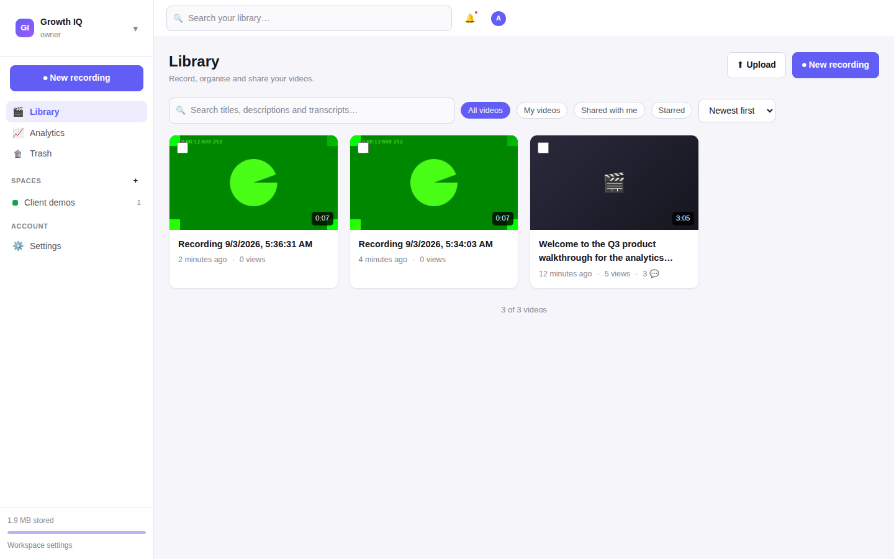
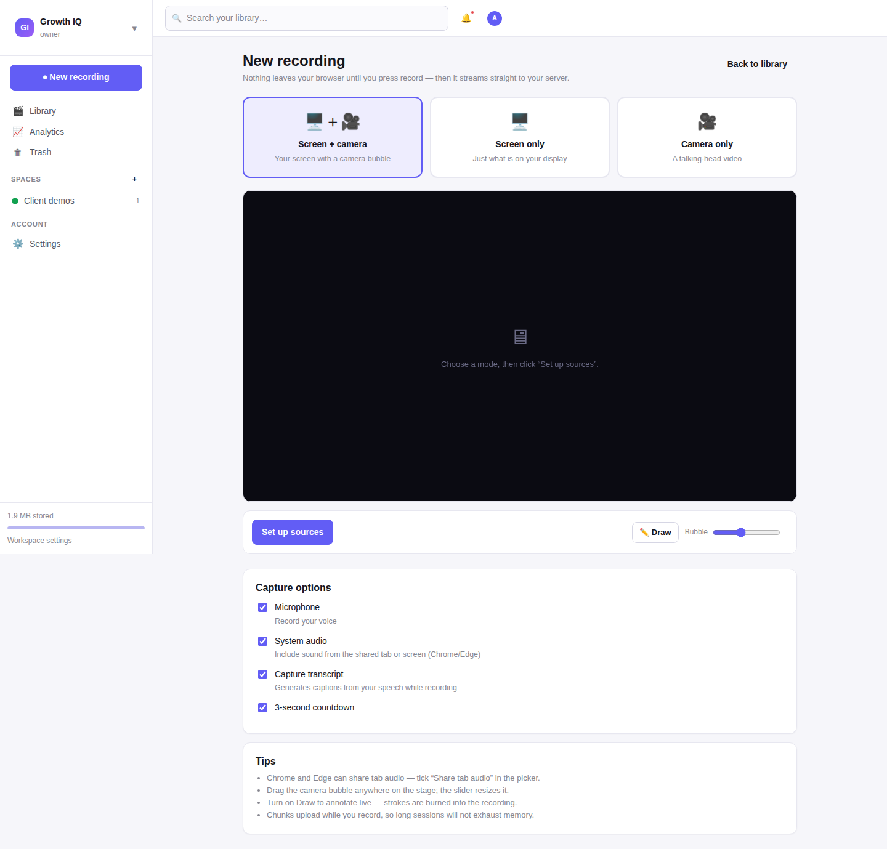
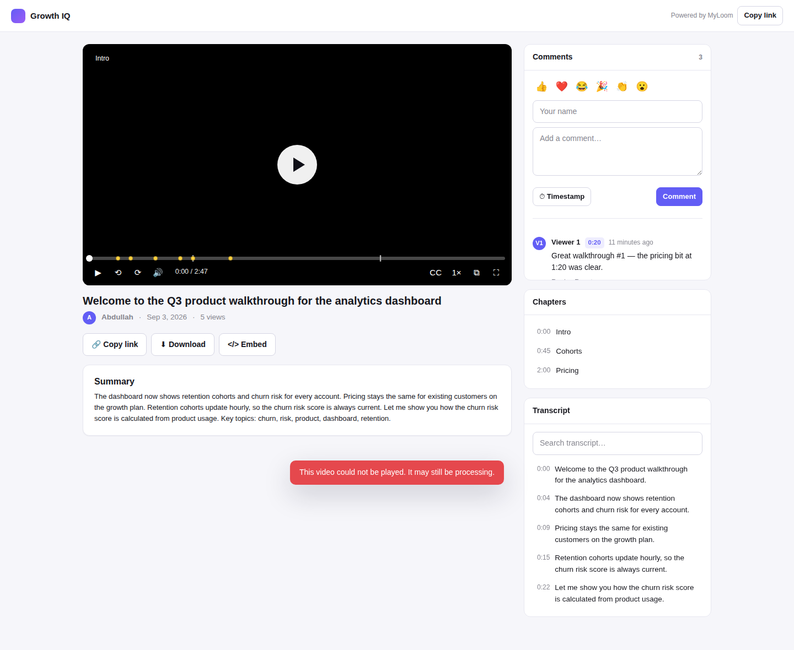
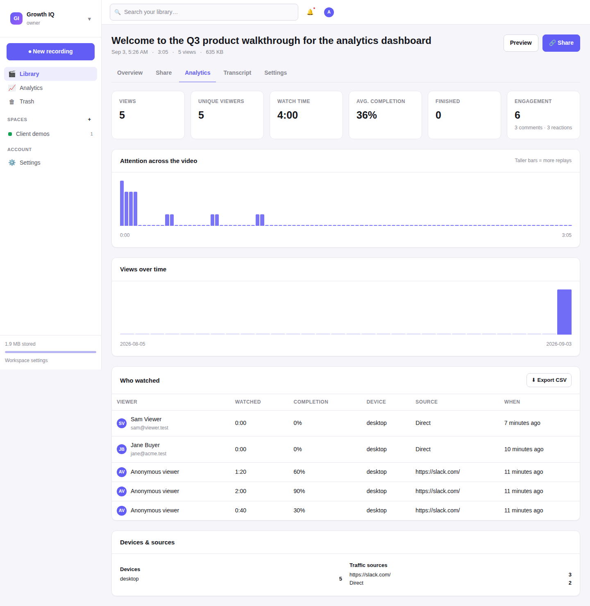
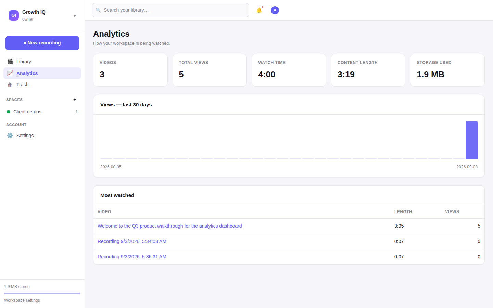
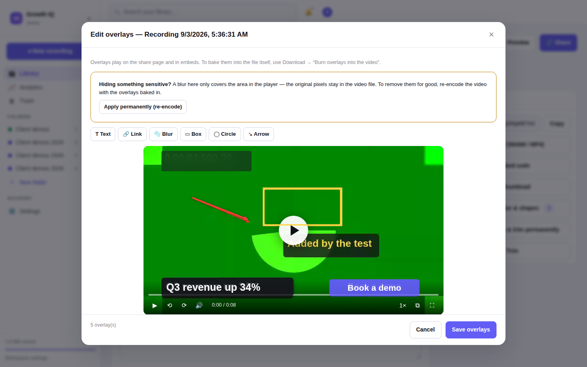
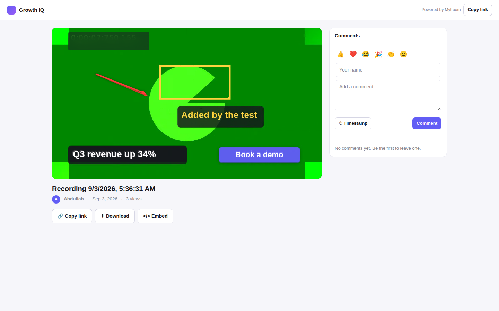

# MyLoom

A self-hosted Loom alternative: record your screen, share a link, and see who
watched. Built to run on ordinary **cPanel shared hosting** — PHP 8 + MySQL,
no Composer, no Node build step, no background workers.



## What it does

Record screen, camera or both with a camera bubble, drawing tools and a live
transcript. Recordings stream to your server in chunks while you record, so
length is limited by disk space rather than browser memory. Share a link with a
password, an expiry date or a view cap, then watch the analytics: who opened it,
how far they got, where they dropped off, and what they said in the comments.

- **Record** — screen / camera / screen + camera, mic and system audio, pause and
  resume, 3-2-1 countdown, live annotation, unlimited length
- **Share** — link, workspace-only, public or private; per-recipient tracked
  links with their own password, expiry and view limit; embed anywhere
- **Analyse** — views, unique viewers, watch time, completion rate, a
  per-second attention graph, devices, traffic sources and CSV export
- **Collaborate** — timestamped comments, threaded replies, emoji reactions,
  workspaces, spaces (folders), roles and email invitations
- **Edit** — cut sections out of the middle, reorder the pieces, strip silences,
  trim, chapters, custom thumbnails, and on-video overlays: text,
  clickable links, blur boxes for anything sensitive, plus boxes, circles and
  arrows. Bake them into the file when you need to
- **Download** — pick WebM or MP4 and the resolution; converted in your browser,
  so no `ffmpeg` is needed on the server
- **Polish** — captions, transcript search, AI or offline summaries, call-to-action
  buttons, your own logo and colour

See [FEATURES.md](FEATURES.md) for a feature-by-feature comparison with paid
Loom, including the things this deliberately does not do.

## Install on cPanel

Full walkthrough with screenshots: **[DEPLOYMENT.md](DEPLOYMENT.md)**. The short
version:

1. Create a MySQL database and user in cPanel → *MySQL® Databases*.
2. Upload the contents of `public_html/` into your domain's `public_html`
   (or a subfolder / subdomain).
3. Set `_storage` to permission **755**.
4. Visit `https://yourdomain.com/install.php` and follow the four steps.
5. Delete `install.php` when the installer offers to.

**HTTPS is required.** Browsers refuse screen and camera capture on plain HTTP.
Turn on AutoSSL in cPanel → *SSL/TLS Status* before you record.

## Requirements

| | |
|---|---|
| PHP | 8.0 or newer with `pdo_mysql`. `mbstring` and `fileinfo` are recommended but not required — built-in fallbacks cover them |
| MySQL | 5.7+ / MariaDB 10.3+ |
| Web server | Apache or LiteSpeed with `mod_rewrite` (a no-rewrite fallback is included) |
| Browser | Chrome, Edge, Firefox or Safari 17+ for recording; anything for watching |

`curl` (for AI summaries) and `openssl` (for SMTP email) are optional too. If
PHP is missing something MyLoom genuinely cannot work without, `install.php`
says which cPanel screen to fix it on rather than failing with a stack trace.

## Local development

```bash
php -S 127.0.0.1:8080 -t public_html dev-server.php
```

`dev-server.php` reproduces the `.htaccess` rewrite rules for PHP's built-in
server. Point the installer at any MySQL instance you have handy.

## Layout

```
public_html/            everything you upload to the server
├── index.php           pages: app shell, /v/<id> watch, /embed/<id>
├── api.php             JSON API front controller
├── file.php            media gateway (access checks + HTTP Range streaming)
├── install.php         setup wizard — delete after installing
├── assets/             css + js, served directly, no build step
├── _app/               PHP source; denied over HTTP
│   ├── controllers/    one class per API group
│   └── views/          server-rendered page shells
└── _storage/           recordings, thumbnails, logs; denied over HTTP
database/schema.sql     the schema the installer imports
```

Recordings never sit in a web-readable folder: `file.php` re-checks permissions
on every request and streams the bytes itself, honouring `Range` so viewers can
seek.

## Licence

MIT — see [LICENSE](LICENSE).

## Screens

| Recorder | Watch page |
|---|---|
|  |  |

| Per-video analytics | Workspace dashboard |
|---|---|
|  |  |

| Overlay editor | Overlays on the share page |
|---|---|
|  |  |
